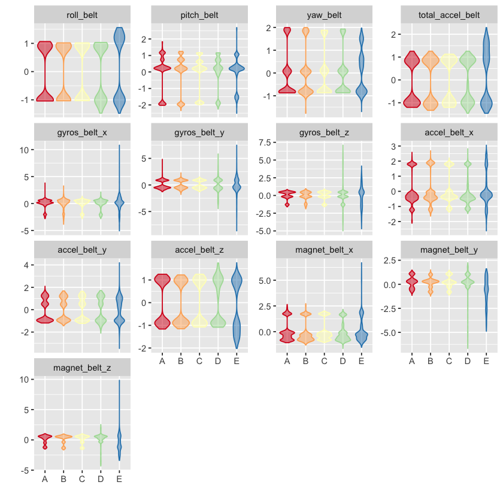
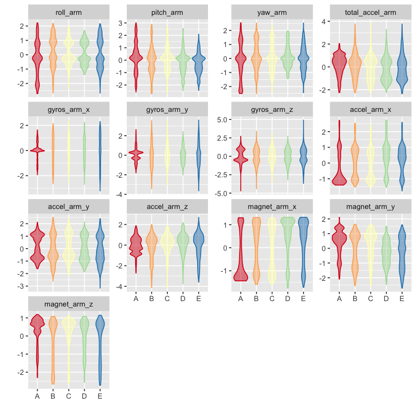
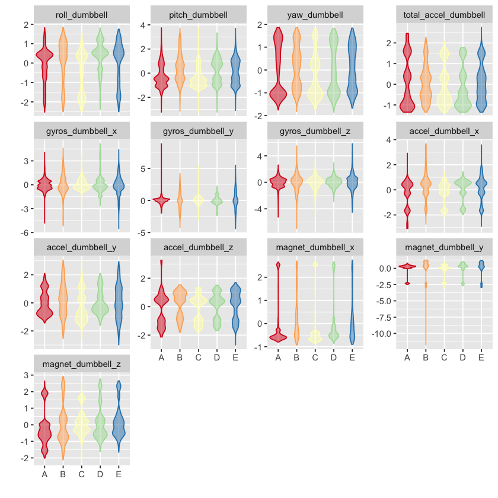
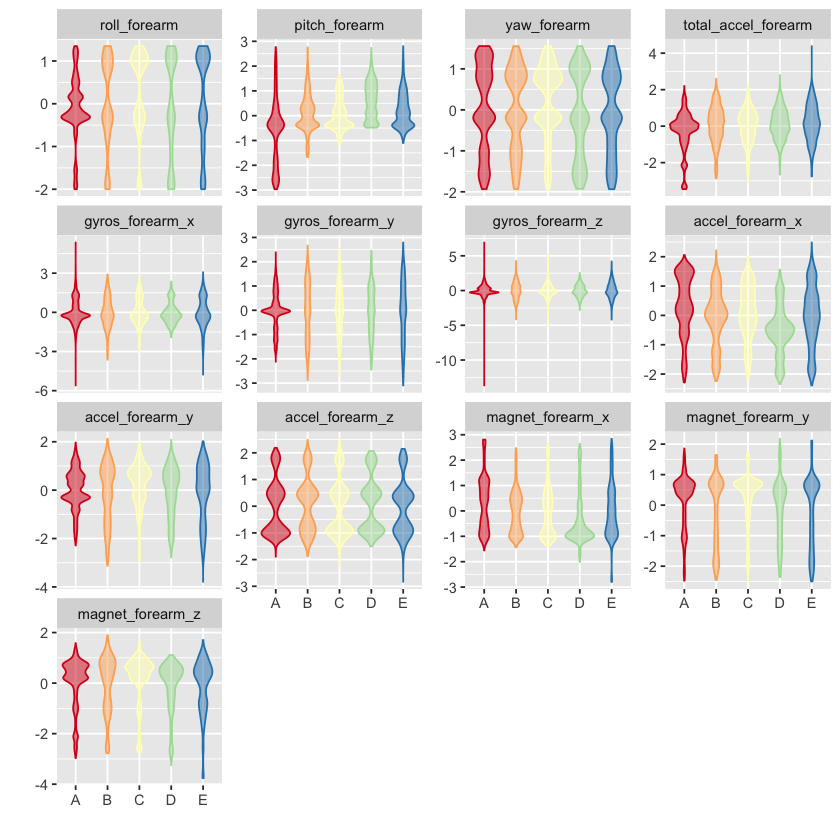

**Background**  
Using devices such as Jawbone Up, Nike FuelBand, and Fitbit it is now possible to  
collect a large amount of data about personal activity relatively inexpensively. These  
type of devices are part of the quantified self movement - a group of enthusiasts who  
take measurements about themselves regularly to improve their health, to find patterns  
in their behavior, or because they are tech geeks. One thing that people regularly do is  
quantify how much of a particular activity they do, but they rarely quantify how well they  
do it. In this project, your goal will be to use data from accelerometers on the belt,  
forearm, arm, and dumbell of 6 participants. They were asked to perform barbell lifts  
correctly and incorrectly in 5 different ways. More information is available from the  
website here: http://groupware.les.inf.puc-rio.br/har (see the section on the Weight  
Lifting Exercise Dataset). 

**Data**  
The training data for this project are available here: https://d396qusza40orc.cloudfront.net/predmachlearn/pml-training.csv  
The test data are available here: https://d396qusza40orc.cloudfront.net/predmachlearn/pml-testing.csv  
The data for this project come from this source:  http://groupware.les.inf.puc-rio.br/har.

#### Prepare the datasets
Read the training data into a data table.


```R
require(data.table)
#setInternet2(TRUE)
url <- "https://d396qusza40orc.cloudfront.net/predmachlearn/pml-training.csv"
train <- fread(url)
```

    Loading required package: data.table


Read the testing data into a data table.


```R
url <- "https://d396qusza40orc.cloudfront.net/predmachlearn/pml-testing.csv"
test <- fread(url)
```

Which variables in the test dataset have zero `NA`s?  
Belt, arm, dumbbell, and forearm variables that do not have any missing values in the test dataset will be **predictor candidates**.


```R
isAnyMissing <- sapply(test, function (x) any(is.na(x) | x == ""))
isPredictor <- !isAnyMissing & grepl("belt|[^(fore)]arm|dumbbell|forearm", names(isAnyMissing))
predCandidates <- names(isAnyMissing)[isPredictor]
predCandidates
```


<ol class=list-inline>
	<li>'roll_belt'</li>
	<li>'pitch_belt'</li>
	<li>'yaw_belt'</li>
	<li>'total_accel_belt'</li>
	<li>'gyros_belt_x'</li>
	<li>'gyros_belt_y'</li>
	<li>'gyros_belt_z'</li>
	<li>'accel_belt_x'</li>
	<li>'accel_belt_y'</li>
	<li>'accel_belt_z'</li>
	<li>'magnet_belt_x'</li>
	<li>'magnet_belt_y'</li>
	<li>'magnet_belt_z'</li>
	<li>'roll_arm'</li>
	<li>'pitch_arm'</li>
	<li>'yaw_arm'</li>
	<li>'total_accel_arm'</li>
	<li>'gyros_arm_x'</li>
	<li>'gyros_arm_y'</li>
	<li>'gyros_arm_z'</li>
	<li>'accel_arm_x'</li>
	<li>'accel_arm_y'</li>
	<li>'accel_arm_z'</li>
	<li>'magnet_arm_x'</li>
	<li>'magnet_arm_y'</li>
	<li>'magnet_arm_z'</li>
	<li>'roll_dumbbell'</li>
	<li>'pitch_dumbbell'</li>
	<li>'yaw_dumbbell'</li>
	<li>'total_accel_dumbbell'</li>
	<li>'gyros_dumbbell_x'</li>
	<li>'gyros_dumbbell_y'</li>
	<li>'gyros_dumbbell_z'</li>
	<li>'accel_dumbbell_x'</li>
	<li>'accel_dumbbell_y'</li>
	<li>'accel_dumbbell_z'</li>
	<li>'magnet_dumbbell_x'</li>
	<li>'magnet_dumbbell_y'</li>
	<li>'magnet_dumbbell_z'</li>
	<li>'roll_forearm'</li>
	<li>'pitch_forearm'</li>
	<li>'yaw_forearm'</li>
	<li>'total_accel_forearm'</li>
	<li>'gyros_forearm_x'</li>
	<li>'gyros_forearm_y'</li>
	<li>'gyros_forearm_z'</li>
	<li>'accel_forearm_x'</li>
	<li>'accel_forearm_y'</li>
	<li>'accel_forearm_z'</li>
	<li>'magnet_forearm_x'</li>
	<li>'magnet_forearm_y'</li>
	<li>'magnet_forearm_z'</li>
</ol>


Subset the primary dataset to include only the **predictor candidates** and the outcome variable, `classe`.


```R
varToInclude <- c("classe", predCandidates)
train <- train[, varToInclude, with=FALSE]
dim(train)
names(train)
```


<ol class=list-inline>
	<li>19622</li>
	<li>53</li>
</ol>


<ol class=list-inline>
	<li>'classe'</li>
	<li>'roll_belt'</li>
	<li>'pitch_belt'</li>
	<li>'yaw_belt'</li>
	<li>'total_accel_belt'</li>
	<li>'gyros_belt_x'</li>
	<li>'gyros_belt_y'</li>
	<li>'gyros_belt_z'</li>
	<li>'accel_belt_x'</li>
	<li>'accel_belt_y'</li>
	<li>'accel_belt_z'</li>
	<li>'magnet_belt_x'</li>
	<li>'magnet_belt_y'</li>
	<li>'magnet_belt_z'</li>
	<li>'roll_arm'</li>
	<li>'pitch_arm'</li>
	<li>'yaw_arm'</li>
	<li>'total_accel_arm'</li>
	<li>'gyros_arm_x'</li>
	<li>'gyros_arm_y'</li>
	<li>'gyros_arm_z'</li>
	<li>'accel_arm_x'</li>
	<li>'accel_arm_y'</li>
	<li>'accel_arm_z'</li>
	<li>'magnet_arm_x'</li>
	<li>'magnet_arm_y'</li>
	<li>'magnet_arm_z'</li>
	<li>'roll_dumbbell'</li>
	<li>'pitch_dumbbell'</li>
	<li>'yaw_dumbbell'</li>
	<li>'total_accel_dumbbell'</li>
	<li>'gyros_dumbbell_x'</li>
	<li>'gyros_dumbbell_y'</li>
	<li>'gyros_dumbbell_z'</li>
	<li>'accel_dumbbell_x'</li>
	<li>'accel_dumbbell_y'</li>
	<li>'accel_dumbbell_z'</li>
	<li>'magnet_dumbbell_x'</li>
	<li>'magnet_dumbbell_y'</li>
	<li>'magnet_dumbbell_z'</li>
	<li>'roll_forearm'</li>
	<li>'pitch_forearm'</li>
	<li>'yaw_forearm'</li>
	<li>'total_accel_forearm'</li>
	<li>'gyros_forearm_x'</li>
	<li>'gyros_forearm_y'</li>
	<li>'gyros_forearm_z'</li>
	<li>'accel_forearm_x'</li>
	<li>'accel_forearm_y'</li>
	<li>'accel_forearm_z'</li>
	<li>'magnet_forearm_x'</li>
	<li>'magnet_forearm_y'</li>
	<li>'magnet_forearm_z'</li>
</ol>


Make `classe` into a factor.


```R
train <- train[, classe := factor(train[, classe])]
train[, .N, classe]
```


<table>
<thead><tr><th scope=col>classe</th><th scope=col>N</th></tr></thead>
<tbody>
	<tr><td>A   </td><td>5580</td></tr>
	<tr><td>B   </td><td>3797</td></tr>
	<tr><td>C   </td><td>3422</td></tr>
	<tr><td>D   </td><td>3216</td></tr>
	<tr><td>E   </td><td>3607</td></tr>
</tbody>
</table>


Split the dataset into a 60% training and 40% probing dataset.


```R
require(caret)
seed <- as.numeric(as.Date("2014-10-26"))
set.seed(seed)
inTrain <- createDataPartition(train$classe, p=0.6)
DTrain <- train[inTrain[[1]]]
DProbe <- train[-inTrain[[1]]]
```

    Loading required package: caret
    Loading required package: lattice
    Loading required package: ggplot2


Preprocess the prediction variables by centering and scaling.


```R
X <- DTrain[, predCandidates, with=FALSE]
preProc <- preProcess(X)
preProc
XCS <- predict(preProc, X)
DTrainCS <- data.table(data.frame(classe = DTrain[, classe], XCS))
```


    Created from 11776 samples and 52 variables
    
    Pre-processing:
      - centered (52)
      - ignored (0)
      - scaled (52)


Apply the centering and scaling to the probing dataset.


```R
X <- DProbe[, predCandidates, with=FALSE]
XCS <- predict(preProc, X)
DProbeCS <- data.table(data.frame(classe = DProbe[, classe], XCS))
```

Check for near zero variance.


```R
nzv <- nearZeroVar(DTrainCS, saveMetrics=TRUE)
if (any(nzv$nzv)) nzv else message("No variables with near zero variance")
```

    No variables with near zero variance


Examine groups of prediction variables.


```R
histGroup <- function (data, regex) {
  col <- grep(regex, names(data))
  col <- c(col, which(names(data) == "classe"))
  require(reshape2)
  n <- nrow(data)
  DMelted <- melt(data[, col, with=FALSE][, rownum := seq(1, n)], id.vars=c("rownum", "classe"))
  require(ggplot2)
  ggplot(DMelted, aes(x=classe, y=value)) +
    geom_violin(aes(color=classe, fill=classe), alpha=1/2) +
#     geom_jitter(aes(color=classe, fill=classe), alpha=1/10) +
#     geom_smooth(aes(group=1), method="gam", color="black", alpha=1/2, size=2) +
    facet_wrap(~ variable, scale="free_y") +
    scale_color_brewer(palette="Spectral") +
    scale_fill_brewer(palette="Spectral") +
    labs(x="", y="") +
    theme(legend.position="none")
}
histGroup(DTrainCS, "belt")
histGroup(DTrainCS, "[^(fore)]arm")
histGroup(DTrainCS, "dumbbell")
histGroup(DTrainCS, "forearm")
```

    Loading required package: reshape2
    
    Attaching package: ‘reshape2’
    
    The following objects are masked from ‘package:data.table’:
    
        dcast, melt
    














#### Train a prediction model

Using random forest, the out of sample error should be small.
The error will be estimated using the 40% probing sample.
I would be quite happy with an error estimate of 3% or less.

Set up the parallel clusters.


```R
require(parallel)
require(doParallel)
library(doParallel)
cl <- makeCluster(detectCores() - 1)
registerDoParallel(cl)
```

    Loading required package: doParallel
    Loading required package: foreach
    Loading required package: iterators


Set the control parameters.


```R
ctrl <- trainControl(classProbs=TRUE,
                     savePredictions=TRUE,
                     allowParallel=TRUE)
```

Fit model over the tuning parameters.


```R
method <- "rf"
system.time(trainingModel <- train(classe ~ ., data=DTrainCS, method=method))
```


        user   system  elapsed 
      51.672    3.762 2850.804 


Stop the clusters.


```R
stopCluster(cl)
```

#### Evaluate the model on the training dataset


```R
trainingModel
hat <- predict(trainingModel, DTrainCS)
confusionMatrix(hat, DTrain[, classe])
```


    Random Forest 
    
    11776 samples
       52 predictor
        5 classes: 'A', 'B', 'C', 'D', 'E' 
    
    No pre-processing
    Resampling: Bootstrapped (25 reps) 
    Summary of sample sizes: 11776, 11776, 11776, 11776, 11776, 11776, ... 
    Resampling results across tuning parameters:
    
      mtry  Accuracy   Kappa    
       2    0.9855896  0.9817724
      27    0.9873282  0.9839718
      52    0.9771134  0.9710496
    
    Accuracy was used to select the optimal model using the largest value.
    The final value used for the model was mtry = 27.


    Confusion Matrix and Statistics
    
              Reference
    Prediction    A    B    C    D    E
             A 3348    0    0    0    0
             B    0 2279    0    0    0
             C    0    0 2054    0    0
             D    0    0    0 1930    0
             E    0    0    0    0 2165
    
    Overall Statistics
                                         
                   Accuracy : 1          
                     95% CI : (0.9997, 1)
        No Information Rate : 0.2843     
        P-Value [Acc > NIR] : < 2.2e-16  
                                         
                      Kappa : 1          
     Mcnemar's Test P-Value : NA         
    
    Statistics by Class:
    
                         Class: A Class: B Class: C Class: D Class: E
    Sensitivity            1.0000   1.0000   1.0000   1.0000   1.0000
    Specificity            1.0000   1.0000   1.0000   1.0000   1.0000
    Pos Pred Value         1.0000   1.0000   1.0000   1.0000   1.0000
    Neg Pred Value         1.0000   1.0000   1.0000   1.0000   1.0000
    Prevalence             0.2843   0.1935   0.1744   0.1639   0.1838
    Detection Rate         0.2843   0.1935   0.1744   0.1639   0.1838
    Detection Prevalence   0.2843   0.1935   0.1744   0.1639   0.1838
    Balanced Accuracy      1.0000   1.0000   1.0000   1.0000   1.0000


#### Evaluate the model on the probing dataset


```R
hat <- predict(trainingModel, DProbeCS)
confusionMatrix(hat, DProbeCS[, classe])
```


    Confusion Matrix and Statistics
    
              Reference
    Prediction    A    B    C    D    E
             A 2229   16    0    0    0
             B    2 1498    7    1    2
             C    0    4 1352   18    7
             D    0    0    9 1265    8
             E    1    0    0    2 1425
    
    Overall Statistics
                                              
                   Accuracy : 0.9902          
                     95% CI : (0.9877, 0.9922)
        No Information Rate : 0.2845          
        P-Value [Acc > NIR] : < 2.2e-16       
                                              
                      Kappa : 0.9876          
     Mcnemar's Test P-Value : NA              
    
    Statistics by Class:
    
                         Class: A Class: B Class: C Class: D Class: E
    Sensitivity            0.9987   0.9868   0.9883   0.9837   0.9882
    Specificity            0.9971   0.9981   0.9955   0.9974   0.9995
    Pos Pred Value         0.9929   0.9921   0.9790   0.9867   0.9979
    Neg Pred Value         0.9995   0.9968   0.9975   0.9968   0.9974
    Prevalence             0.2845   0.1935   0.1744   0.1639   0.1838
    Detection Rate         0.2841   0.1909   0.1723   0.1612   0.1816
    Detection Prevalence   0.2861   0.1925   0.1760   0.1634   0.1820
    Balanced Accuracy      0.9979   0.9925   0.9919   0.9905   0.9939


#### Display the final model


```R
varImp(trainingModel)
trainingModel$finalModel
```


    rf variable importance
    
      only 20 most important variables shown (out of 52)
    
                         Overall
    roll_belt            100.000
    pitch_forearm         60.142
    yaw_belt              53.838
    pitch_belt            46.489
    roll_forearm          45.165
    magnet_dumbbell_y     43.873
    magnet_dumbbell_z     42.966
    accel_dumbbell_y      21.103
    magnet_dumbbell_x     17.692
    roll_dumbbell         17.641
    accel_forearm_x       17.143
    magnet_forearm_z      14.021
    total_accel_dumbbell  13.993
    accel_dumbbell_z      13.960
    magnet_belt_y         13.765
    magnet_belt_z         13.345
    accel_belt_z          13.344
    yaw_arm               11.625
    gyros_belt_z          11.092
    magnet_belt_x          9.877


    
    Call:
     randomForest(x = x, y = y, mtry = param$mtry) 
                   Type of random forest: classification
                         Number of trees: 500
    No. of variables tried at each split: 27
    
            OOB estimate of  error rate: 0.86%
    Confusion matrix:
         A    B    C    D    E class.error
    A 3341    5    2    0    0 0.002090800
    B   17 2253    8    1    0 0.011408513
    C    0   13 2033    8    0 0.010223953
    D    1    1   30 1895    3 0.018134715
    E    0    2    2    8 2153 0.005542725


**The estimated error rate is less than 1%.**

Save training model object for later.


```R
save(trainingModel, file="trainingModel.RData")
```

#### Predict on the test data
Load the training model.


```R
load(file="trainingModel.RData", verbose=TRUE)
```

    Loading objects:
      trainingModel


Get predictions and evaluate.


```R
DTestCS <- predict(preProc, test[, predCandidates, with=FALSE])
hat <- predict(trainingModel, DTestCS)
DTest <- cbind(hat , test)

```

#### Submission to Coursera


```R
pml_write_files = function(x){
  n = length(x)
  path <- "./answers"
  for(i in 1:n){
    filename = paste0("problem_id_",i,".txt")
    write.table(x[i],file=file.path(path, filename),quote=FALSE,row.names=FALSE,col.names=FALSE)
  }
}
pml_write_files(hat)
```
